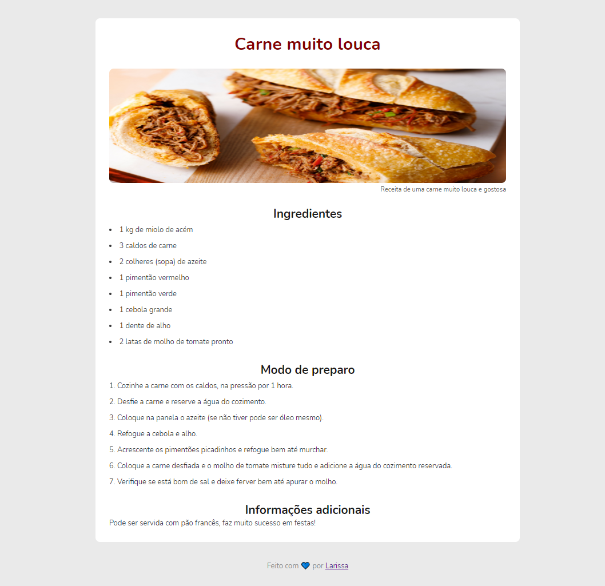

# recipe-page
## Desafio Piloto: Página de Receita

- Desafio feito durante o curso Discovery da @Rocketseat.

### Sobre o desafio
- Nesse desafio devemos criar uma página web de uma receita com título, imagem, lista de ingredientes e modo de preparo. O desafio está dividido em duas partes, no primeiro momento criamos a estrutura HTML com as informações da receita e na segunda parte adicionamos os estilos à página com o CSS.

